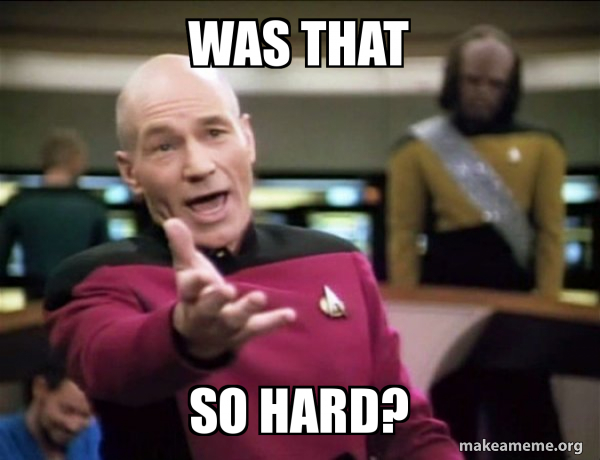

<!-- Example of title -->
My exercise in Markdown<!-- omit in toc -->
===
<!-- Here comes the table of content -->

Table of content

- [Line break](#line-break)
- [Types of text editing](#types-of-text-editing)
  - [Bold](#bold)
  - [Italic](#italic)
  - [Text striketought](#text-striketought)
- [Links and images](#links-and-images)
  - [Links](#links)
  - [Images](#images)
  - [Images with hover text](#images-with-hover-text)
- [Equation](#equation)
- [Codes](#codes)
  - [Inline code](#inline-code)
  - [Block of code](#block-of-code)
  - [Code highlighting](#code-highlighting)
- [Quote](#quote)
- [List](#list)
  - [Bullet list](#bullet-list)
  - [Numbered list](#numbered-list)
- [Table](#table)

<!-- Example of paragraph of text with line break -->
# Line break
This is example of text with line break.  
This is the break.

This is second sentence on this excerise (from another paragraph).

<!-- Example of another paragraph -->
What this paragraph shows is that no metter how much i would try o extend/break that line the Markdown will keep text all in line "14".
# Types of text editing
## Bold
<!-- Example of bold -->
This is **bold** text  
This is also __bold__ text
## Italic
<!-- Example of italic  -->
This is _italic_ / _kursywy_
## Text striketought
<!-- Example of text striketought  -->
This ~~is not text~~ that i want to show.

<!-- Example of headers -->
# Links and images
## Links


<!-- Example of external link -->

[Take a break...](https://www.youtube.com/watch?v=dQw4w9WgXcQ)

<!-- Example of link to another file -->

[and then go back to where we started](Empty.md)

Both links to external and internal files are added as follows: square bracket is text and than rounded bracket is the link/file

## Images

<!-- Example of an image from local file -->



It's important to add exclamation point before bracket so the image shows in text. The quote mark gives you possibility to add hover text.

<!-- Example of an image from internet/external links -->


## Images with hover text
<!-- Example of an image with hover text -->

Well... I did it already but it is good to exercise!

")

<!-- Example of equation or inline code -->
# Equation

$$ c= a^2 + b^2 $$

$$ a = 2 $$

$$ b^2 = 5a $$

# Codes

## Inline code
Inline `code` works, when you do `back-ticks` around it.

<!-- Example of a block of code -->
## Block of code
What triggers the block of code is ``` both at the beggigning and the end of the block.

This is the example: 
``` 
whatever I choose to write here will be treated as a new block of code
```
<!-- Example of code highlighting -->
## Code highlighting
```javascript
var s = "Javascript syntax highlighting";
alert(s);
```

<!-- Example of quote -->
# Quote
As my grandfather used to say:

> Any fool can get cold :bowtie:

<!-- Example of bullet list -->
# List
## Bullet list

This time I share the things I am proud of:
* my cat
* my will to change for better
* my positive energy and sense of humor :satisfied:

Not much, huh?

<!-- Example of numbered list -->
## Numbered list
What did I learn so far?
1. SPACES - if you miss them, so will the action you want to trigger :rage1:
2. They more you learn, the hungrier you are. :hamburger:
3. We got to the number 3 so I think this proofs enought :smile:

Leave at least one empty line so Markdown knows this does not belong to the number list

<!-- Example of table -->
# Table
| 1st Column | 2nd Column | 3rd Column     |
| ---------- | ---------- | -------------- |
| Dogs       | Cats       | Chickens       |
| 4 paws     | 4 paws     | 2 paws (legs?) |
| all        | meat only  | all            |

<!-- Paragraph after table -->
Leave at least one empty line so Markdown knows this does not belong to the table
